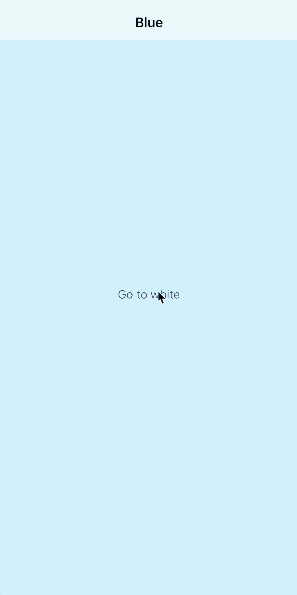

# Lecture 04. Navigation and Workflow

 [iOS Application Development WS17/18 by RWTH Aachen University](https://itunes.apple.com/jm/course/ios-application-development-ws17-18/id1288558355)​

## Lecture 04. Navigation and Workflow 

### Auto Layout + Stack View 

* Auto Layout: specifies set of constraints and relationships btw. elements and their places
* Stack View: manages the layout of all the views
  * arranged along the axis, distribution, alignment, spacing
* Dynamically adapted to the device's orientation/screen size/any changes in the available space

### [Safe Area](https://developer.apple.com/documentation/uikit/uiview/positioning_content_relative_to_the_safe_area)

* demo in the course

### [Seques](https://developer.apple.com/library/archive/featuredarticles/ViewControllerPGforiPhoneOS/UsingSegues.html)

* demo in the course

### Navigation Controllers

* demo in the course

