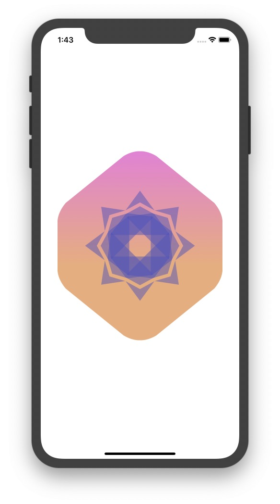
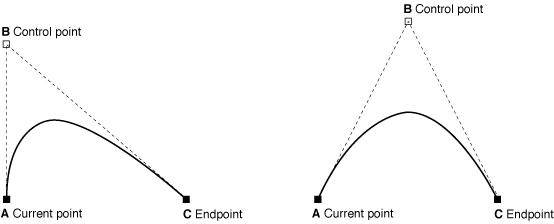

# Drawing Paths and Shapes







```swift
...
    GeometryReader { geometry in
            Path { path in
                var width: CGFloat = min(geometry.size.width, geometry.size.height)
                let height = width
                let xScale: CGFloat = 0.832
                let xOffset = (width * (1 - xScale)) / 2.0
                width *= xScale
                path.move(
                    to: CGPoint(
                        x: xOffset + width * 0.95,
                        y: height * (0.20 + HexagonParameters.adjustment)
                    )
                )
                HexagonParameters.points.forEach {
                    path.addLine(
                        to: .init(
                            x: xOffset + width * $0.useWidth.0 * $0.xFactors.0,
                            y: height * $0.useHeight.0 * $0.yFactors.0
                        )
                    )
                    
                    path.addQuadCurve(
                        to: .init(
                            x: xOffset + width * $0.useWidth.1 * $0.xFactors.1,
                            y: height * $0.useHeight.1 * $0.yFactors.1
                        ),
                        control: .init(
                            x: xOffset + width * $0.useWidth.2 * $0.xFactors.2,
                            y: height * $0.useHeight.2 * $0.yFactors.2
                        )
                    )
                }
            }
            .fill(LinearGradient(
                gradient: .init(colors: [Self.gradientStart, Self.gradientEnd]),
                startPoint: .init(x: 0.5, y: 0),
                endPoint: .init(x: 0.5, y: 0.6)
            ))
            .aspectRatio(1, contentMode: .fit)
        }
...
```



```swift
...
struct Badge: View {
    static let rotationCount = 8
    
    var badgeSymbols: some View {
        
        ForEach(0..<Badge.rotationCount) { i in
            RotatedBadgeSymbol(
                angle: .degrees(Double(i) / Double(Badge.rotationCount) * 360.0)
            )
        }
        .opacity(0.5)
    }
    
    var body: some View {
        ZStack {
            BadgeBackground()
            
            GeometryReader { geometry in
                self.badgeSymbols
                    .scaleEffect(1.0 / 4.0, anchor: .top)
                    .position(x: geometry.size.width / 2.0, y: (3.0 / 4.0) * geometry.size.height)
            }
        }
        .scaledToFit()
    }
}
...
```



### CGPoint

A structure that containts a point in a two-dimensional coordinate system.

### Path

The out line of a 2D Shape

* `func move(to: CGPoint)`  : begins a new subpath at the specified point and waits to start drawing.
* `func addLine(to: CGPoint)` : appends a stright line segment from the curront point to the specified point.
* `func addQuadCurve(to: CGPoint, control: CGPoint)` : adds a quadratic Bézier curve to the path with the specified **end point** and **control point**.



### GeometryReader

A container view that defines its content as **a function of its own size and coordinate space**.

* Wrap the path in a GeometryReader ➡ Use the size of its container.
* `xOffset` is calculated for the left and right empty spaces.
* `func padding(_ length: CGFloat) -> some View` : gives a padding along all edge insets by the amount\(length\)
* `func rotationEffect(_ angle: Angle, anchor: UnitPoint = .center) -> some View` : rotates a view by the given angle and anchor point of rotation is center as default.

### LinearGradient

Applies the color function along an axis, as defined by its start and end points.

* `init(gradient:startPoint:endPoint:)`
  * `gradient: .init(colors:)`: create a gradient from an array of colors.
* `aspectRatio(_:contentMode:)` : the gradient fill by a given ratio

