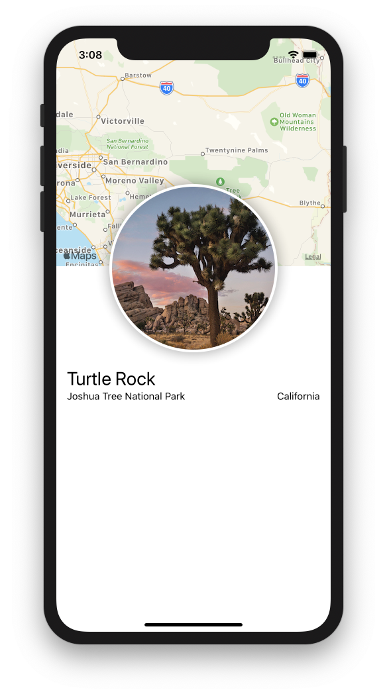

# Creating and Combining Views

> [https://developer.apple.com/tutorials/swiftui/creating-and-combining-views](https://developer.apple.com/tutorials/swiftui/creating-and-combining-views)



## Creating a New Project and Customize the Text View

### View Protocol


```swift
import SwiftUI

struct ContentView: View {
    var body: some View {
        // Text("Hello World")
        Text("Turtle Rock")
            .font(.title)
    }
}
...
```


* Describes the view's content and layout
* body propertiy only returns a single view. ➡ [need to combine and embeded multiple views](creating-and-combining-views.md#combining-views-using-stacks).

### Preview


```swift
...
struct ContentView_Preview: PreviewProvider {
    static var previews: some View {
        ContentView()
    }
}
...
```


* Updates to reflect the change what you did in a view's body property.

### Modifier

* Call to customize a SwiftUI view
* Wrap a view to change its display or other properties
* Each Modifiers returns a new view -&gt; chain multiple modifiers, **stacked vertically**. 

## Combining Views using Stacks


```swift
import SwiftUI

struct ContentView: View {
    var body: some View {
        VStack(alignment: .leading) {
            Text("Turtle Rock")
                .font(.title)
            HStack {
                Text("Joshua Tree National Park")
                    .font(.subheadline)
                Spacer()
                Text("California")
                    .font(.subheadline)
            }
        }
        .padding()
    }
}
...
```


### VStack / HStack / ZStack

* Groups multiple views together vertically / horizontally / back to front.
* Set `alignment: HorizontalAlignment` of the views by editing the initializer
  * `.center`: default
  * `.leading`
  * `.trailing`
* Provides context-appropriate spacing.

### Spacer

* To use the full width of the device, use `Spacer()` between two views.
* Expands to make its containing view use all of the space of its parent view.

## Create a Custom Image View


```swift
import SwiftUI

struct CircleImage: View {
    var body: some View {
        Image("turtlerock")
            .clipShape(Circle())
            .overlay(
                Circle().stroke(Color.white, lineWidth: 4))
            .shadow(radius: 10)   
    }
}

struct CircleImage_Previews: PreviewProvider {
    static var previews: some View {
        CircleImage()
    }
}
```


* `Image(_:)`: Initializer
* `clipShape(Circle())`: the circular clipping shpate to the image

### Use UIKit and SwiftUI Views Together + MapKit


```swift
import SwiftUI
import MapKit

struct MapView: UIViewRepresentable {
    func makeUIView(context: Context) -> MKMapView {
        MKMapView(frame: .zero)    // Empty map view
    }
    
    func updateUIView(_ view: MKMapView, context: Context) {
        // Coordinates to center the map on Turtle Rock
        let coordinate = CLLocationCoordinate2D(latitude: 34.011286, longitude: -116.166868)
        let span = MKCoordinateSpan(latitudeDelta: 2.0, longitudeDelta: 2.0)
        let region = MKCoordinateRegion(center: coordinate, span: span)
        view.setRegion(region, animated: true)
    }
}

struct MapView_Previews: PreviewProvider {
    static var previews: some View {
        MapView()
    }
}
```


* `protocol UIViewRepresentable` : A view that represents a UIKit view.
  * **Two requirements** need to add
    * `makeUIView(context: )`: create an UIView
    * `updateUIView(_: context: )`: configures the view and responds to any changes

## Compose the Detail View


```swift
...
struct ContentView: View {
    var body: some View {
        VStack{    // Wrapping by VStack
            MapView()
                .edgesIgnoringSafeArea(.top)
                .frame(height: 300)
            
            CircleImage()
                .offset(y: -130)
                .padding(.bottom, -130)
            
            VStack(alignment: .leading) {
                Text("Turtle Rock")
                    .font(.title)
                HStack {
                    Text("Joshua Tree National Park")
                        .font(.subheadline)
                    Spacer()
                    Text("California")
                        .font(.subheadline)
                }
            }
            .padding()
            
            Spacer()    // To push the content to the top of the screen.
        }
    }
}
...
```


* `frame(width:height:)` set the size of the view
  * Specify only the `height` parameter ➡ automatically sized to the width of its content.
* `edgesIgnoringSafeArea(.top)` allow the content to extend to the top edge of the screen.

